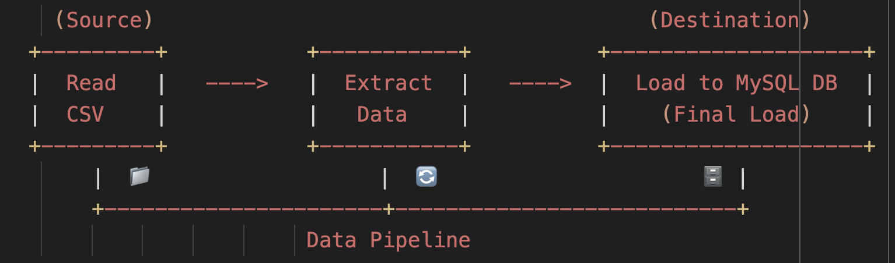

# 🚀 ELT Data Pipeline — Extract, Load, and Transform



A robust and user-friendly **CLI-based** CSV-to-MySQL pipeline tool that:

- Connects to the source (CSV file), validates, and reads data
- Infers the schema and displays an ERD
- Connects to the destination (MySQL database)
- Dynamically creates corresponding MySQL tables
- Performs **upserts** and **soft deletes** for smart synchronization
- Provides real-time **CLI feedback** with colorized logs and progress bars

---

## 📦 Features

- ✅ Command-line interface with progress indicators
- 🔐 Secure credential handling via `getpass`
- 📁 CSV inspection with ERD-style output
- 🛢️ Dynamic MySQL table creation based on CSV schema
- 🔄 Intelligent sync (upsert + soft delete)
- 🧪 Validations for host, port, user, database, etc.
- 🌈 Styled logging using `colorama` and real-time **CLI feedback**

---

## 🛠️ Requirements

- Python 3.11+
- `colorama`
- `pandas`
- `mysql-connector-python`
- `tqdm`

Install dependencies:

```bash
pip3 install -r requirements.txt
```

---

## ⚙️ Usage

```
python pipeline.py path/to/your_file.csv
```
